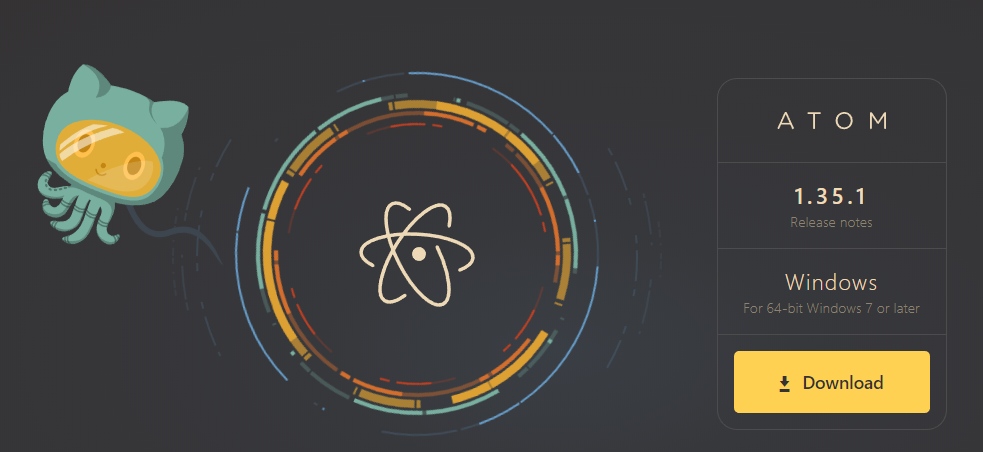
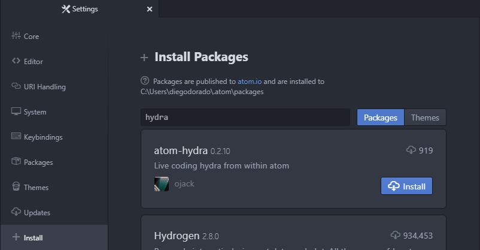
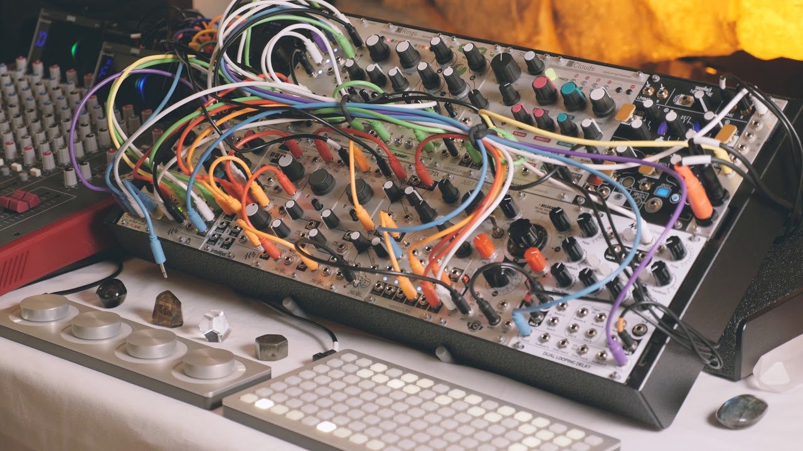
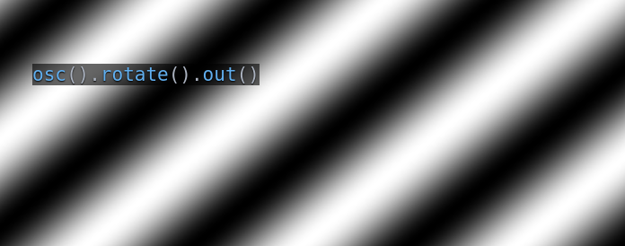
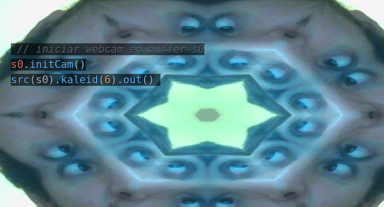

Taller de hydra
===============

## ¿Qué es hydra?

Hydra es una plataforma para hacer live coding de visuales, creada por [Olivia Jack](https://github.com/ojack) e inspirada en los sintetizadores analógicos modulares.
Cada fuente de video (cámaras, formas geometricas, osciladores, etc) pueden ser transformados, modulados y compuestos a través de una combinación de funciones.


## Instalación y Uso

Hydra puede usarse directamente  [desde un navegador web](https://hydra-editor.glitch.me/).  
Allí se puede cargar un *sketch* aleatorio clickando en el botón  y comenzar a modificar los parámetros para ver los resultados que produce presionando  `ctrl + Enter`.


También es posible instalar hydra en el editor de textos [atom](http://atom.io)


### Instalar atom

Descargar e instalar el editor de textos [atom](https://atom.io/)



### Instalar hydra
 Ir a las preferencias de atom ( `ctrl + ,` ) y buscar e instalar el package `atom-hydra`

 

### Uso

  * Activar hydra ( Packages -> atom-hydra -> Toggle )
  * Crear un archivo de extensión `.js` para usar con hydra.
  * Escribir `osc().out()`
  * Ejecutar ( `ctrl + Enter`)

## ¿Cómo funciona?

Hydra se inspira en la síntesis modular en dónde cada módulo realiza una operación específica y se interconectan las entradas y salidas de varios módulos para producir resultados más complejos de los que puede realizar un módulo por separado.



Los módulos de sintetizadores modulares suelen estar categorizados en **generadores** o **modificadores**. Por ejemplo, un **VCO** (oscilador controlado por voltaje) es un **generador**, mientras que un **VCF** (filtro controlado por voltaje) es un **modificador**.


En hydra se sigue esta lógica y cada función puede ser vista como un módulo de síntesis de video.

### Primeros pasos

Si ejecutamos en hydra `osc().rotate().out()` veremos lo siguiente



Aquí hay tres funciones encadenadas por puntos: `osc()` , `rotate()` y `out()`, y podemos pensar estos puntos como cables que conectan los módulos entre sí (`osc--->rotate--->out`)

En el ejemplo, `osc` es un **generador** (un oscilador) cuya salida está conectada a la entrada de `rotate`, que es un **modificador** (gira el video), cuya salida está conectada a la entrada de `out`, que es el módulo que finalmente muestra la señal de video en pantalla.

En este otro ejemplo, como **generador** utilizamos la webcam, luego de iniciarla con `s0.initCam()`. La salida de `src(s0)` (la webcam) está conectada a la entrada del **modificador** `kaleid` indicandole la cantidad de caras por parámetro (`6`), y su salida finalmente a `out`.

```js
// iniciar webcam en buffer s0
s0.initCam()
//  webcam --> kaleid --> out
src(s0).kaleid(6).out()
```




### Utilizando listas como parámetros

En lugar de un parámetro fijo ( como el número de caras de `kaleid`) podemos pasar una lista del siguiente modo:

```js
// iniciar webcam en buffer s0
s0.initCam()
//  webcam --> kaleid --> out
src(s0).kaleid([4,6,20,50]).out()
```

De este modo, la cantidad de caras de `kaleid` irá variando con el tiempo. Si queremos variar su velocidad, reemplazamos `[4,6,20,50]` por `[4,6,20,50].fast(10)` o  `[4,6,20,50].fast(0.01)`

```js
// kaleid cambiando a 0.2 de velocidad
voronoi()
  .kaleid([8,12,100].fast(0.2))
  .color(2,0,0)
  .out()
```

Y esto es válido para cualquier parámetro de cualquier función.

```js
voronoi([1,10,100].fast(0.01))
  .kaleid([8,12,4].fast(0.02))
  .color([0.2,0.5],[0.1,0.3],1)
  .colorama([1,0.2,30,0.5].fast(0.01))
  .rotate([0,10,90])
  .out()
```


### Mezclando señales
...
### Utilizando audio
...  


*...continuará...*


[Aquí](https://github.com/ojack/hydra/blob/master/docs/funcs.md) está el listado de las funciones disponibles en hydra.
